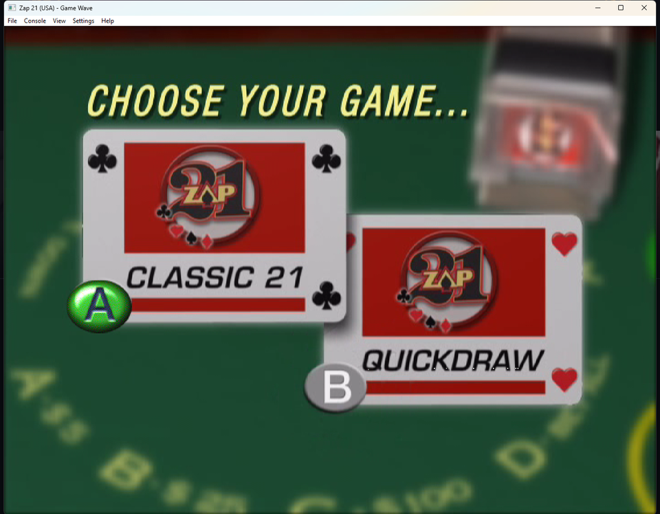
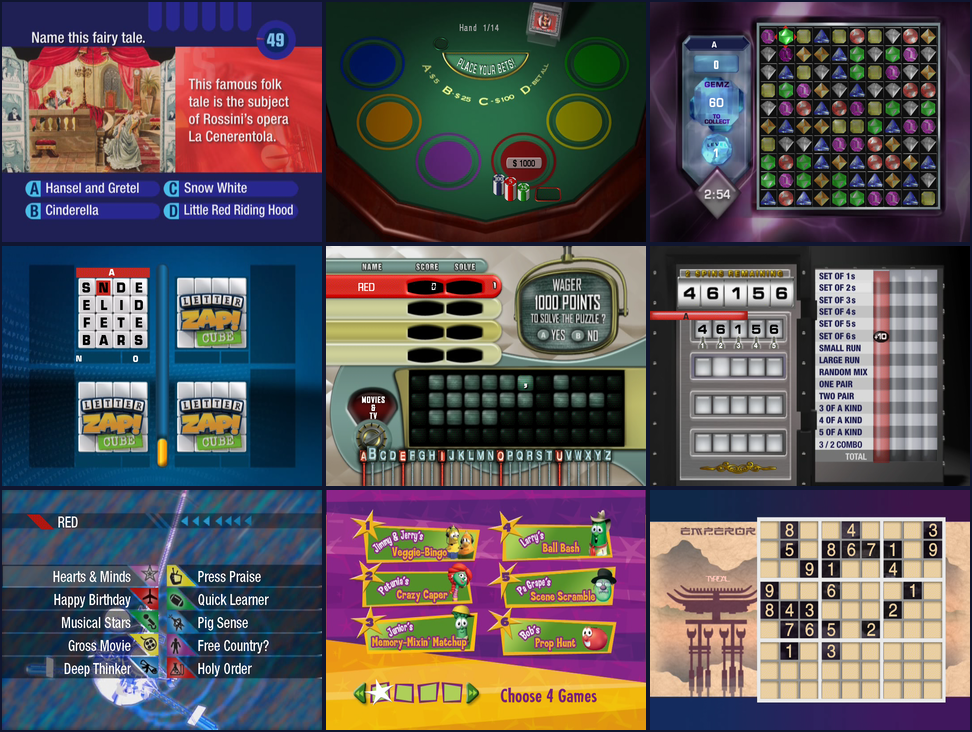

<div align="center">


**Play Game Wave discs on your PC.**


<br>



</div>

# gamewave

An emulator for the **Game Wave Family Entertainment System**, the DVD-based party game
console from ZAPiT Games.

A Game Wave game is not machine code. Each disc carries its game as **Lua 5.0 bytecode**
and a folder of movies, stills, bitmaps, fonts and sounds, and the console's firmware runs
that program against an engine of on-screen overlays, MPEG playback and colour-coded
remotes. `gamewave` does the same: it runs each game's own program on its own Lua
interpreter and rebuilds the engine around it, so the games play exactly as they were
written, with nothing about them patched or guessed.

```
gamewave "Zap 21 (USA).zip"
```

## What it does

- **Every retail disc boots** and plays: trivia, card, word, puzzle and party games alike.
  See [Compatibility](#compatibility).
- **Movies**: MPEG-2 video and MPEG audio, decoded by the emulator itself and kept in
  step with the sound, with deinterlacing for the interlaced ones.
- **The on-screen display**: overlays, fonts, fades, slides and frame animations drawn
  over the video exactly as the games place them.
- **Six player remotes**: the keyboard is one, and every game controller you plug in is
  another, each playing as its own colour. For hot-seat play, Ctrl + 1 to 6 switch which
  remote the keyboard is.
- **Save memory**: high scores and settings are kept between sessions, like the console's
  flash memory.
- **Discs as they come**: an `.iso`, a `.zip` holding one (unpacked once, in the
  background), or a folder of a disc's files.
- **Menus**: a real application menu bar on Windows, plus an in-window menu that works
  everywhere and with a controller: your games, settings, controller assignment and full
  rebinding.
- **Headless CLI**: inspect a disc, or run one with no window, pressing keys and taking
  screenshots on a timetable.

<div align="center">



<em>4 Degrees · Zap 21 · Gemz<br>
Letter Zap! · Click! · Lock 5<br>
Rewind 2006 · VeggieTales: Veg-Out! Family Tournament · Sudoku</em>

</div>

## Compatibility

These are the retail discs `gamewave` has been tested against. Each boots, reaches its
menus, and survives a soak test of random remote presses.

| Disc | Kind | Status |
|------|------|--------|
| 4 Degrees: The Arc of Trivia, Volume 1 | Trivia | Playable |
| 4 Degrees: The Arc of Trivia, Volume 2 | Trivia | Playable |
| 4 Degrees: The Arc of Trivia, Bible Edition | Trivia | Playable |
| Click! | Party | Playable |
| Gemz | Puzzle | Playable |
| Letter Zap! | Word | Playable |
| Lock 5 | Party | Playable |
| Rewind (and Rev 1) | Trivia | Playable |
| Rewind 2005, Discs A and B | Trivia | Playable |
| Rewind 2006, Discs A and B | Trivia | Playable |
| Sudoku | Puzzle | Playable |
| VeggieTales: Veg-Out! Family Tournament | Party | Playable |
| Zap 21 | Card | Playable |

## Installing

Every [release](../../releases/latest) carries self-contained builds that need no .NET
runtime, each with SDL2 beside the binary:

| Platform | Download |
|----------|----------|
| Windows x64 | `gamewave-windows-x86_64.zip` |
| Linux x64 / arm64 | `gamewave-linux-x86_64.tar.gz` / `gamewave-linux-arm64.tar.gz` |
| macOS Apple silicon / Intel | `gamewave-macos-arm64.tar.gz` / `gamewave-macos-x86_64.tar.gz` |

### Windows

Unzip anywhere and run `gamewave.exe`. It is a GUI program, so double-clicking it or
starting it from a launcher opens the console and never a console window. The command line
still works from a prompt; see [The command line on Windows](#the-command-line-on-windows).

### Linux and macOS

```sh
tar -xzf gamewave-linux-x86_64.tar.gz
./gamewave-linux-x86_64/gamewave "Some Disc.iso"
```

Keep the SDL2 library beside `gamewave`; an installed SDL2 is preferred when there is one.
The native menu bar is Windows-only, so use the in-window menu (Escape). These builds are
not tested before each release; reports are welcome.

## Building

Building from source needs the [.NET SDK 10.0](https://dotnet.microsoft.com/download);
SDL2 and the MPEG audio decoder arrive through NuGet.

```sh
dotnet build -c Release
dotnet test
```

The binary lands in `src/GameWave/bin/Release/net10.0/`. Pushing a `v*` tag that matches
`<Version>` in `src/GameWave/GameWave.csproj` builds every platform and publishes a release.

## Discs

Point `gamewave` at a disc image (`.iso`), at a `.zip` holding one, or at a folder of a
disc's files. A zip is unpacked the first time it is played, with progress on screen, into
a cache that keeps the three most recently played discs (about 4 GB each; see
`emulation.unpackDirectory` and `emulation.unpackedDiscsKept`). Choose a **game folder** and
the Games page lists every disc in it.

No disc images are included in this repository, and none are needed to build or test it.

## Playing

```
gamewave <disc> [options]
```

| Option | Effect |
|--------|--------|
| `--fullscreen` / `--windowed` | Override the saved window mode |
| `--scale N` | Window size as a multiple of 640 x 480 |
| `--volume N` | Volume, 0 to 100 |
| `--mute` | Start silent |
| `--log N` | Show the game's own log, 0 (none) to 5 (debug) |
| `--no-config` | Ignore the settings file and use defaults; nothing is saved |

Run `gamewave` with no disc, or double-click `gamewave.exe`, and the console opens empty.
Put a disc in from there with **Ctrl + O** (File > Open Disc), the **Games** page, **Recent
discs**, or by dropping an `.iso` or `.zip` on the window. Options override the saved
settings for that run only.

### The remotes

Each player on a Game Wave has a remote of their own colour, and the games ask each player
to press **SEL** on theirs to join. In `gamewave`:

- The **keyboard** is the red remote.
- Each **game controller** is a remote too: the first plays as red, the second yellow, then
  blue, green, purple and orange. Settings > Controllers changes who is who.
- **Ctrl + 1** to **Ctrl + 6** make the keyboard play as red, yellow, blue, green, purple
  or orange, so one person can join several players, or players can take turns.

| Remote | Keyboard | Controller |
|--------|----------|------------|
| Up / Down / Left / Right | Arrow keys | D-pad or left stick |
| SEL | Enter or Space | Start or right shoulder |
| A / B / C / D | A / B / C / D keys | A / B / X / Y |
| 0 to 9 | Number row or keypad | |
| Game menu | G | Back |
| DVD menu | Home | Left shoulder |

### Default controls

| Key | Action |
|-----|--------|
| Escape | Open the menu (and back out of it) |
| P | Pause |
| Ctrl + R or F5 | Reset the console |
| Ctrl + E | Open or close the disc tray |
| Ctrl + O | Open a disc |
| Ctrl + 1 to 6 | Keyboard plays as red to orange |
| `-` / `=` | Volume down / up |
| Ctrl + M | Mute |
| Tab | Cycle the status overlay |
| F11 or Alt + Enter | Full screen |
| F12 | Screenshot |
| Ctrl + Q | Quit |

Every one of these, and every key on every remote, can be rebound to the keyboard or to a
controller. The guide button or a click of the right stick opens the menu from a
controller.

### Menus and settings

On Windows there is an ordinary application menu bar (**File**, **Console**, **View**,
**Settings**, **Help**), opened with the mouse, Alt or F10. Escape opens the same pages drawn
inside the picture instead; that one is what full screen, controllers and the other
platforms use, and it is where controls are rebound. `interface.nativeMenuBar` turns the bar
off.

- **Games**: every disc in your game folder, and the discs played recently.
- **Picture**: scaling, 4:3 or 16:9 shape, filtering, deinterlacing, overscan, window size.
- **Sound**: volume, the movie and effect levels, and the output buffer.
- **Console**: pausing in the menu or in the background, the game folder, and erasing the
  save memory.
- **Controllers**: which remote each controller plays as, stick sensitivity, and repeating
  held directions.
- **Controls**: every action and remote key rebindable. Enter captures the next key or
  button for that kind of control (keyboard or controller), Right adds another, Left
  clears, Delete restores the default.

Settings save as you change them, and every one of them is also readable and writable from
the shell.

### The disc tray

The two-disc *Rewind* sets open the tray at the end of a game. The console then shows
"Please insert disc": open the other disc (Ctrl + O), or close the tray (Ctrl + E) to play
the same one again.

## The command line on Windows

On Windows `gamewave.exe` is built as a GUI program so that it never opens a console of its
own, and it borrows the console of whatever started it instead. **cmd and PowerShell do not
wait for a GUI program when you type its name at the prompt**: the prompt comes back
straight away and the output follows it. In PowerShell, pipe it anywhere to wait:
`gamewave info disc.iso | Out-Default`. Batch files and Git Bash wait normally.

## Inspecting and running a disc

```
gamewave info <disc>                      What the disc is and what it holds
gamewave run  <disc> [--seconds N] [--press MS:KEY[:REMOTE],...] [--shot MS:FILE.png,...]
                     [--monkey MS] [--saves FILE] [--log N]
gamewave disasm <file.zbc>                Disassemble a game program
```

`gamewave run` plays a disc with no window and no sound device. Key presses and screenshots
happen at the given times in milliseconds of console time, and `--monkey` presses random
keys for soak testing:

```sh
gamewave run "Zap 21 (USA).iso" --seconds 60 --press 40000:select,50000:select --shot 55000:menu.png
```

## Settings from the command line

```
gamewave config list [filter]             gamewave bind list [filter]
gamewave config get <setting>             gamewave bind set <action> <control>
gamewave config set <setting> <value>     gamewave bind add <action> <control>
gamewave config reset [<setting>|all]     gamewave bind clear <action>
gamewave config path                      gamewave bind reset [<action>|all]
                                          gamewave bind keys
```

Controls are named like `RedSelect`, `YellowA` or `TogglePause`; `gamewave bind list` shows
them all. A control is a key name (`Space`, `Ctrl+R`), a controller button (`Pad:A`) or a
stick direction (`Pad:LeftX+`).

```sh
gamewave config set emulation.gameDirectory "D:/Games/Game Wave"
gamewave bind add YellowSelect Tab
```

## How it works

[docs/format.md](docs/format.md) has the full write-up: the disc layout, the bytecode and
its integer numbers, every engine module the games call, and the image, font, sound and
dictionary formats, with notes on which behaviour was read out of the console's own engine
code.

## Not affiliated

Game Wave and the game titles are trademarks of their owners. This project is not
affiliated with or endorsed by them.
